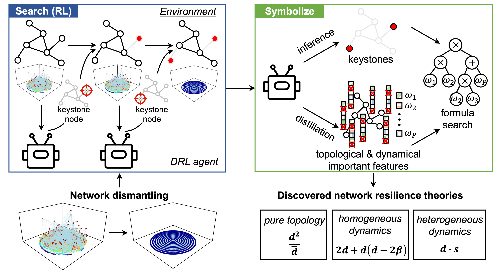

# Selinda

Selinda is a self-inductive AI for advancing network resilience theories.
Contributors to this project are from the [Future Intelligence Lab](https://fi.ee.tsinghua.edu.cn) at [Tsinghua University](https://www.tsinghua.edu.cn/en/).

---

Featuring a symbolized reinforcement learning framework, Selinda learns from how AI solves a complicated network dismantling problem and symbolizes its network attack strategies into theoretical formulas.
This framework establishes a comprehensive set of network resilience theories, including the first-ever resilience theory that accounts for both network topology and dynamics in non-linear and heterogeneous systems, as well as two new resilience theories that refine existing well-established ones regarding pure topology and homogeneous dynamics.


## Installation

### Environment
- Tested OS: Linux (Ubuntu 22.04.1 LTS, training and testing)
- Python: 3.11.0
- Pytorch: 2.0.0
- CUDA: 11.7
- Julia: 1.9.3

### Package Dependencies
```bash
pip install -r requirements.txt
```

## Usage
### Search with reinforcement learning (RL)
```bash
bash app_rl.sh
```

### Distill with explainable artificial intelligence (XAI)
```bash
bash app_explain.sh
```

### Discover with symbolic regression (SR)
Generate the dataset for SR:
```bash
bash app_sr_data.sh
```
Run SR:
```bash
export PATH=$PATH:path/to/julia
bash app_sr.sh
```

## Baselines

> [!NOTE]
> For the following two baselines (FINDER and GDM), you will need to change to another Python 3.7 environment to run them (tested on Linux only).
> We recommend using [Anaconda](https://www.anaconda.com/) or [Virtualenv](https://virtualenv.pypa.io/en/latest/) to manage multiple Python environments.
>
 
### FINDER
You will need to change to another Python 3.7 environment to run FINDER, with the following packages installed:
```
cython==0.29.13
networkx==2.3
pandas==0.25.2
scipy==1.3.1
tensorflow==1.14.0
```
Then, make all the files:
```bash
cd thirdparty/FINDER/code/FINDER_ND/
python setup.py build_ext -i
```

### GDM
You will need to change to another Python 3.7 environment to run GDM, with the following packages installed:
```
torch==1.0.1
torch-cluster==1.2.4
torch-scatter==1.1.2
torch-sparse==0.2.4
torch-spline-conv==1.0.6
torch-geometric==1.1.2
```

> [!NOTE]
> For the following four baselines (GND, EI, CI, and CoreHD), you will need to first install a C++ compiler and dependencies (tested on Linux only):
> 
> ```bash
> sudo apt install build-essential gcc-12 g++-12 cmake libboost-all-dev libomp-dev
>```


### GND
You will need to compile the C++ code:
```bash
cd thirdparty/GND/
make
```

### EI
You will need to compile the C code:
```bash
cd thirdparty/EI/
make -C Library
```


### CI
You will need to compile the C code:
```bash
cd thirdparty/CI/
make
```


### CoreHD
You will need to compile the C++ code:
```bash
cd thirdparty/CoreHD/
make
```


## Topological resilience
We apply the framework to discover pure topological resilience theories for networks without running system dynamics.

First, train a DRL agent to identify critical nodes for network topology dismantling
```bash
bash app_rl_topology.sh
```

Then, distill the important node features in the RL agent
```bash
bash app_explain_topology.sh
```

Finally, discover the hidden mathematical connections between important features and critical nodes
```bash
bash app_sr_data_topology.sh
bash app_sr_topology.sh
```


## Reproducing and refining classical physical metrics
We apply the self-inductive framework to re-discover or refine the following classical physical metrics in a fully data-driven manner, while their original proposals are based on physical intuitions and heavy derivations:
- &beta; ([Nature, 2016](https://www.nature.com/articles/nature16948k))
- resilience centrality ([Physical Review E, 2020](https://journals.aps.org/pre/abstract/10.1103/PhysRevE.101.022304))

The first search process is shared between the two metrics. We train a DRL agent to identify critical nodes in dynamical homogenous scenarios:
```bash
bash app_rl_homo.sh
```

For resilience centrality, we distill knowledge from the policy network which selects nodes for removal, similar to the above workflow.
```bash
bash app_explain_homo_policy.sh # utilize XAI to identify important node features for the policy network
bash app_sr_data_homo_policy.sh # generate training data for SR
bash app_sr_homo_policy.sh # utilize SR to derive a physical metric that mimics the policy network
```

As for &beta;, it describes the current resilience state of the network, which is achieved by the value network in our DRL agent estimating how far a network is to losing its resilience.
Meanwhile, &beta; is a network-level index rather than a node-level one, the primitives for SR also become network-level features.
Therefore, we distill the value network instead.
```bash
bash app_explain_homo_value.sh # utilize XAI to identify important node features for the value network
bash app_sr_data_homo_value.sh # generate training data for SR
bash app_sr_homo_value.sh # utilize SR to derive a physical metric that mimics the value network
```


